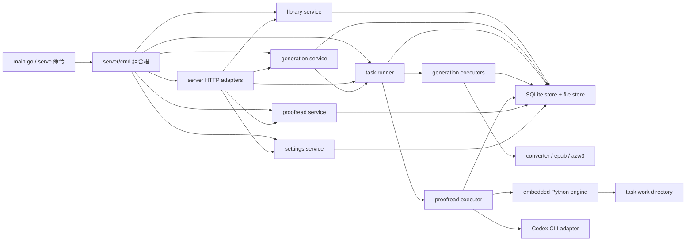

# Kindle Toolbox Web UI v1 完整开发方案

状态：可执行开发基线

编制日期：2026-07-17

产品范围与行为以 [`product-design.md`](product-design.md) 为准。本文把产品基线转换为具体的架构、数据模型、模块边界、实现顺序、测试矩阵和阶段验收，不新增账号、云同步、书籍级配置、EPUB 修复器或任务断点恢复。

## 1. 方案摘要

Web UI v1 在现有 Go CLI、TXT/EPUB 解析器和原生 AZW3 writer 上渐进实现，不先重写转换核心，也不先按技术层大规模拆包。

开发按三个纵向切片推进：

1. 建立 SQLite 书库、不可变原文件、后台任务、多产物和 Kindle 下载闭环。
2. 增加 TXT 预览、EPUB 兼容性报告、全局设置、搜索和筛选。
3. 接入 Codex CLI，完成 TXT/EPUB 校对、候选复核、修订文件、报告和审计闭环。

每个切片必须完成旧路径清理、自动化测试和端到端验收后再进入下一切片。最终仍交付 [`product-design.md`](product-design.md) 中定义的完整 v1。

## 2. 已确认的实现决策

### 2.1 产品与运行边界

- 管理 Web UI 和 Kindle 下载页均面向可信局域网，不增加账号、登录或访问令牌。
- 桌面 Web UI 使用 Go `html/template` 服务端渲染，允许少量原生 JavaScript 轮询任务状态，不引入 SPA、Node.js 或前端构建链。
- Kindle 页面保持独立只读 mux、纯 HTML、无 JavaScript，并继续使用单独监听地址。
- 继续保留单一 Go CLI 入口和 `vocab`、`txt2epub`、`serve` 三条产品线。
- `internal/epub`、`internal/azw3`、`internal/txt2epub` 和 `internal/converter` 中已经验证的格式逻辑优先复用。

### 2.2 数据与任务

- 书库元数据、任务、候选、决策和设置使用 SQLite；文件内容继续保存在书库目录。
- 复用仓库已有的 `github.com/mattn/go-sqlite3`，不新增第二个 SQLite driver。
- 原始文件由应用层保证不可变，并在关键操作前验证 SHA-256。
- 任务只有 `queued`、`running`、`completed`、`failed`、`canceled` 五种状态。
- 不提供暂停、恢复或 `interrupted` 状态。
- App 重启时，旧的 `running` 任务转为 `failed`；`queued` 任务继续等待。
- 用户点击重试时创建新任务并完整从头执行，不复用旧任务进度或工作目录。
- AI 校对全局只运行一本书；单书内部允许多个 Codex CLI 子进程并发。
- 格式生成使用独立单 worker 队列，避免同时生成多个大型文件造成不可预测的内存峰值。
- 格式生成与 AI 校对可以各运行一个任务，互不阻塞。

### 2.3 文件与配置

- TXT 原文件硬限制为 32 MiB。
- EPUB 原文件硬限制为 64 MiB，ZIP 中所有条目的声明解压大小总和硬限制为 512 MiB。
- EPUB 兼容性检查未通过时禁止 AZW3 生成，不提供强制转换或产品内修复。
- 不保存书籍级转换配置。每次预览从全局默认值开始，成功产物保存实际参数快照。
- 启动参数、监听地址和书库目录仍由 CLI 参数与配置文件提供。
- Web UI 可修改的全局 TXT 默认值、Kindle EPUB 开关和校对设置保存在书库数据库中。
- 设置优先级为：CLI 启动参数高于配置文件；数据库中的 Web 全局设置高于配置文件对应默认值；代码默认值最低。

### 2.4 校对引擎

- v1 复用 `long-novel-proofreader` 和 `long-epub-proofreader` 中已经验证的确定性脚本，不在接入 Web UI 的同时重写 EPUB 精确字节补丁逻辑。
- 分别在现有 `long-novel-proofreader` 和 `long-epub-proofreader` 目录增加 `embed.go`，就地嵌入各自的 `scripts/` 和 `references/`，不复制或移动 Skill 源文件；启动时释放到带版本号的运行目录。设置页诊断 `python3` 和 Codex CLI。
- Go 负责业务数据库、任务状态、并发、Codex CLI 调用、Web UI 和产物登记。
- Python 脚本只负责批次切分、位置校验、EPUB 精确补丁、报告与审计文件生成。
- 脚本的可恢复状态只作为单个 `running` 任务内部的工作格式。任务失败、取消或进程退出后，该状态不得被新任务复用。
- 成功校对运行的批次、候选和复核结果导入 SQLite；后续修订任务基于数据库决策快照创建新的临时脚本状态副本。

## 3. 当前实现与需要替换的边界

### 3.1 可以保留的深层模块

- `internal/converter`：CLI 与 Web 共用的格式组合校验和转换入口。
- `internal/txt2epub/text`：TXT 编码检测、清理和断行处理。
- `internal/txt2epub/book`：章节识别、目录和段落模型。
- `internal/epub`：EPUB2/EPUB3 读取、资源解析、CSS 和内部链接校验。
- `internal/azw3`：原生 KF8/AZW3 writer 及大量二进制回归测试。
- `internal/config`：版本化 TOML/YAML 配置加载和 CLI 默认值。
- 两套校对脚本：不可变源文件、候选定位、双轮复核和确定性应用契约。

### 3.2 当前所有权泄漏

- `internal/server/http.go` 同时负责路由、表单解析、输出命名、同步转换、错误状态和模板，HTTP handler 知道过多业务步骤。
- `internal/server/library.go` 同时负责目录创建、JSON 持久化、文件复制、路径解析和“最新输出”覆盖，无法表达任务、修订和多产物。
- `internal/server/converter.go` 是 Web 表单与转换服务之间的临时适配层，转换仍由请求 goroutine 同步执行。
- `internal/txt2epub/app.Run` 同时解析 TXT、打印预览并写文件，Web 无法取得结构化预览结果。
- `internal/epub.Read` 返回 `ebook.Book` 或首个错误，不能直接生成可持久化的结构化兼容性报告。
- 校对脚本尚未接入 Go 任务队列、Codex CLI 调用和 Web 候选复核。

### 3.3 重构原则

- 先完成一个真实用户流程，再抽取下一个行为所有者。
- HTTP handler 只接收意图并渲染 projection，不直接写文件、运行转换或修改任务状态。
- SQLite store 不解释业务流程；导入、生成、任务和校对服务拥有事务顺序与副作用。
- 不为每张表建立一层只有透传方法的 repository interface。
- 只有外部进程、时钟和任务 executor 使用接口，以便取消和测试替身。
- 一个切片切换成功后立即删除旧路径，不长期维护 JSON/SQLite 或同步/后台两套实现。

## 4. 目标架构



### 4.1 调用方向

```text
HTTP/CLI 入口
  → 用例服务（导入、生成、任务、校对、设置）
    → SQLite Store / 文件存储 / 外部进程适配器
      → 已有 TXT/EPUB/AZW3 核心
```

禁止反向依赖：

- `library`、`task` 和 `proofread` 不导入 `internal/server`。
- `converter` 不依赖 SQLite、HTTP 或任务状态。
- `epub` 和 `azw3` 不知道书库目录、任务 ID 或 Web DTO。
- HTTP 模板不直接拼接磁盘相对路径，只使用文件 ID 下载 URL。

### 4.2 目标包结构

```text
internal/
├── store/
│   ├── store.go              # SQLite 打开、事务和领域查询
│   ├── schema.go             # migrations 与 PRAGMA
│   ├── files.go              # 安全路径、临时文件和原子提交
│   └── legacy.go             # index.json 一次性迁移
├── library/
│   ├── model.go              # Book、File、CompatibilityReport projection
│   ├── service.go            # 列表、详情和下载查询
│   ├── import.go             # 流式导入、限制、哈希和重复检测
│   └── delete.go             # 级联删除与删除收敛
├── generation/
│   ├── service.go            # 验证输入、冻结参数并创建任务
│   └── executor.go           # 格式生成和产物提交
├── task/
│   ├── model.go              # 类型、状态和进度
│   ├── service.go            # 创建、取消、重试和查询
│   ├── runner.go             # 单一调度器、两个执行槽与启动恢复
│   └── executor.go           # Executor 接口和注册
├── proofread/
│   ├── model.go              # Run、Candidate、Decision、RevisionSnapshot
│   ├── service.go            # 开始校对、人工决策和生成修订
│   ├── executor.go           # 完整校对任务编排
│   ├── engine.go             # Python 命令适配和嵌入资源
│   ├── codex.go              # Codex CLI 非交互适配器
│   ├── prompts.go            # 初审、复核和图片审阅提示词
│   └── schemas/              # 结构化输出 JSON Schema
├── settings/
│   ├── service.go            # 设置优先级、校验和持久化
│   └── diagnostics.go        # Codex/Python/运行环境诊断
├── converter/
│   ├── service.go            # 保留格式转换能力
│   ├── txt_analysis.go       # TXT 结构化分析，预览与生成共用
│   └── epub_analysis.go      # EPUB 兼容性 projection
└── server/
    ├── server.go             # 两个 http.Server 生命周期
    ├── handler.go            # 依赖与 mux
    ├── books.go              # 书库/详情/导入/删除
    ├── tasks.go              # 任务列表/取消/重试/状态 JSON
    ├── previews.go           # TXT 预览和 EPUB 检查展示
    ├── proofreads.go         # 候选复核和修订动作
    ├── settings.go           # 全局设置与诊断
    ├── kindle.go             # Kindle 只读页面
    ├── downloads.go          # 文件 ID 下载
    ├── templates/            # go:embed HTML 模板
    └── static/               # go:embed CSS 和少量 JS
```

实现过程中不要求一次性创建全部文件。只有当某个纵向切片产生了真实行为所有者时才建立对应包。

### 4.3 深模块和公开契约

不采用“一个总 App 包管理全部行为”，也不按数据库表创建一组 repository interface。前者会把所有变化汇集到巨型 service，后者只是把 SQL 参数原样搬到薄包装中。

推荐的公开形状：

```go
type LibraryService struct { /* concrete store */ }
func (s *LibraryService) Import(ctx context.Context, req ImportRequest) (ImportResult, error)
func (s *LibraryService) ConfirmImport(ctx context.Context, token, action string) (Book, error)
func (s *LibraryService) ListBooks(ctx context.Context, q BookQuery) (BookPage, error)
func (s *LibraryService) GetBook(ctx context.Context, id string) (BookDetail, error)
func (s *LibraryService) DeleteBook(ctx context.Context, id string) error

type GenerationService struct { /* store + task service */ }
func (s *GenerationService) Create(ctx context.Context, req GenerationRequest) ([]Task, error)

type TaskService struct { /* concrete store + running cancel map */ }
func (s *TaskService) Cancel(ctx context.Context, id string) error
func (s *TaskService) Retry(ctx context.Context, id string) (Task, error)
func (s *TaskService) List(ctx context.Context, q TaskQuery) (TaskPage, error)

type ProofreadService struct { /* store + task service */ }
func (s *ProofreadService) Start(ctx context.Context, req StartRequest) (Task, error)
func (s *ProofreadService) Decide(ctx context.Context, req DecisionRequest) error
func (s *ProofreadService) CreateRevision(ctx context.Context, req RevisionRequest) (Task, error)
func (s *ProofreadService) GetRun(ctx context.Context, id string) (RunDetail, error)

type SettingsService struct { /* bootstrap config + store + command runner */ }
func (s *SettingsService) Get(ctx context.Context) (SettingsView, error)
func (s *SettingsService) Update(ctx context.Context, req SettingsUpdate) error
func (s *SettingsService) Diagnose(ctx context.Context, req DiagnosticRequest) (Diagnostics, error)
```

隐藏在这些接口后的复杂性：

- `LibraryService` 隐藏上传限制、哈希、重复确认、文件提交、查询 projection 和级联删除。
- `GenerationService` 隐藏输入验证、参数快照、双格式任务和来源 provenance。
- `TaskService/Runner` 隐藏单一持久化队列、执行槽分配、FIFO、取消竞争、重启收敛和状态事务。
- `ProofreadService` 隐藏批次、Codex 调用、候选定位、决策审计和修订快照。
- `SettingsService` 隐藏配置优先级、范围校验、依赖探测和可写诊断。

真实 seam 只放在会变化或需要故障注入的位置：

```go
type Executor interface {
    Execute(ctx context.Context, task Task, progress ProgressReporter) error
}

type ModelClient interface {
    ReviewBatch(ctx context.Context, input BatchInput) ([]Candidate, error)
    VerifyCandidate(ctx context.Context, input VerificationInput) (Verification, error)
    ReviewImage(ctx context.Context, input ImageInput) ([]Candidate, error)
}

type CommandRunner interface {
    Run(ctx context.Context, spec CommandSpec) (CommandResult, error)
}
```

SQLite store 保持 concrete，不为了测试建立一套等大的接口；测试直接使用临时 SQLite。删除任一上述 service 都会把事务、状态规则或副作用重新扩散到多个 handler/executor，因此这些模块有足够深度。

## 5. 书库目录与文件提交协议

### 5.1 目录布局

```text
<library>/
├── library.db
├── originals/<book-id>/<file-id>.<ext>
├── revisions/<book-id>/<file-id>.<ext>
├── artifacts/<book-id>/<file-id>.<ext>
├── reports/<book-id>/<proofread-run-id>/<file-id>.<ext>
├── proofreads/<book-id>/<proofread-run-id>/engine-state/
├── incoming/<operation-id>.part
├── work/<task-id>/
├── runtime/proofreader-v<engine-version>/
├── originals/                  # 旧版目录，迁移后继续按原路径引用
├── converted/                  # 旧版目录，迁移后继续按原路径引用
└── index.json                  # 旧版索引，迁移成功后保留只读备份
```

新文件名只使用内部随机 ID 和受控扩展名。用户下载名称保存在数据库，不直接参与磁盘路径拼接。

### 5.2 文件写入规则

1. 所有新内容先写到同一书库文件系统内的 `.part` 或 `work/<task-id>`。
2. 写入时同时计算 SHA-256 和实际字节数。
3. 关闭文件并完成格式校验后，才创建或更新数据库记录。
4. 正式文件使用 `os.Rename` 原子移动到目标目录。
5. 文件记录只有 `ready` 状态才允许下载和出现在列表中。
6. 启动时清理没有数据库引用且超过 24 小时的 `incoming` 和失败任务工作目录。
7. 原始文件成功导入后不再以写方式打开；每次校对和修订前重新验证 SHA-256。

文件系统与 SQLite 无法组成同一事务，因此采用 `pending → ready` 收敛：

- 数据库先记录 `pending` 文件和预期目标路径。
- 文件原子移动成功后把记录更新为 `ready`。
- App 启动时检查残留 `pending`：文件完整且哈希匹配则完成提交，否则删除临时文件和记录。

### 5.3 ID 和时间

- 继续使用 `crypto/rand` 生成 128 bit 随机 ID，编码为 32 位小写十六进制，不新增 UUID 依赖。
- 数据库时间统一保存为 UTC RFC3339Nano 文本，展示时转换为本地时区。
- 队列顺序使用数据库自增整数 `queue_seq`，不用时间戳推断 FIFO。

## 6. SQLite 数据模型

### 6.1 连接设置

打开数据库后固定执行：

```sql
PRAGMA foreign_keys = ON;
PRAGMA journal_mode = WAL;
PRAGMA synchronous = NORMAL;
PRAGMA busy_timeout = 5000;
```

连接池限制为一个写连接和少量读连接。所有跨表状态变更使用显式事务。

### 6.2 表定义

| 表 | 关键字段 | 责任 |
| --- | --- | --- |
| `schema_migrations` | `version`, `applied_at` | 数据库版本与幂等迁移 |
| `runtime_lock` | `instance_id`, `pid`, `heartbeat_at` | 阻止同一书库被两个 `serve` worker 同时执行 |
| `settings` | `key`, `value_json`, `updated_at` | Web 全局设置覆盖值 |
| `books` | `id`, `display_name`, `source_format`, `state`, `imported_at` | 书籍聚合根；`state` 为 `active/deleting` |
| `files` | `id`, `book_id`, `role`, `state`, `format`, `display_name`, `rel_path`, `sha256`, `size_bytes`, `source_file_id`, `task_id`, `proofread_run_id`, `parameters_json`, `has_unresolved`, `created_at` | 原文件、修订文件、产物、报告和审计文件 |
| `tasks` | `id`, `book_id`, `type`, `status`, `queue_seq`, `input_file_id`, `retry_of_task_id`, `parameters_json`, `stage`, `progress_current`, `progress_total`, `error_code`, `error_message`, `created_at`, `started_at`, `finished_at` | 单一持久化任务队列与进度 |
| `task_events` | `task_id`, `seq`, `level`, `stage`, `message`, `created_at` | 面向用户和诊断的阶段事件，不保存整段正文 |
| `compatibility_reports` | `id`, `file_id`, `source_sha256`, `status`, `metadata_json`, `spine_json`, `toc_json`, `resources_json`, `issues_json`, `checked_at` | 原始或修订 EPUB 的检查快照 |
| `proofread_runs` | `id`, `book_id`, `source_file_id`, `task_id`, `source_sha256`, `format`, `model`, `batch_size`, `concurrency`, `status`, `engine_version`, `engine_state_rel_path`, `created_at`, `completed_at` | 一次完整校对运行及其不可变成功状态 |
| `proofread_candidates` | `id`, `run_id`, `kind`, `location_json`, `expected_original`, `category`, `first_confidence`, `first_replacement`, `verification`, `verified_replacement`, `reason`, `created_at` | 双轮模型结果和稳定源位置 |
| `candidate_decisions` | `id`, `candidate_id`, `decision`, `replacement`, `created_at` | append-only 人工接受、拒绝或修改记录 |
| `revision_candidates` | `revision_file_id`, `candidate_id`, `outcome`, `replacement` | 某个修订文件冻结的候选决策快照 |

### 6.3 约束与索引

- `books.source_format` 只能为 `txt` 或 `epub`。
- `files.role` 只能为 `original`、`revision`、`artifact`、`report`、`audit`。
- `files.state` 只能为 `pending`、`ready`、`deleting`。
- 每本书只能有一个 `role = original` 的文件，使用 partial unique index 保证。
- 同一本书允许同 SHA 的多次显式导入，因为它们属于不同 `book_id`。
- `tasks.status` 使用 CHECK 限制为五种产品状态。
- `tasks(type, status, queue_seq)` 用于 worker 取队列。
- `files(book_id, role, format, created_at DESC)` 用于详情页和 Kindle 最新产物查询。
- `files(sha256, role)` 用于导入重复检测。
- `proofread_candidates(run_id, created_at)` 和 `candidate_decisions(candidate_id, created_at DESC)` 用于候选页面。
- `compatibility_reports.file_id` 唯一；每个不可变文件只保留一份对应其 SHA 的检查结果。

### 6.4 运行实例锁

- 启动时在事务中原子领取 `runtime_lock`。
- 每 5 秒更新一次 heartbeat。
- 15 秒内存在其他实例 heartbeat 时拒绝启动 worker，并显示占用实例 PID。
- heartbeat 超过 15 秒视为旧进程残留，可以接管。
- 正常关闭时主动释放；异常退出由超时接管。

该锁只限制后台 worker，不改变可信局域网的产品安全边界。

## 7. 旧书库迁移

第一次打开没有 v1 数据的数据库且发现 `index.json` 时执行一次性迁移：

1. 解析旧 `Index.Records`，验证所有 `rel_path` 仍位于书库目录内。
2. 验证原文件存在，重新计算大小、格式和 SHA-256。
3. 每条旧记录创建一本书和一个 `original` 文件记录，继续引用旧文件路径，不移动字节。
4. 旧 `Output` 如果存在，创建一个 `artifact` 文件记录，参数标记为 `{"legacy_import":true}`。
5. 旧 `LastError` 写入一本迁移说明事件，不伪造任务。
6. 全部记录在单个 SQLite 事务中提交；任一记录失败则整个迁移回滚。
7. 成功后写入 migration marker，但保留原 `index.json`、`originals/` 和 `converted/`，不删除或覆盖。

迁移测试必须覆盖：空索引、同名文件、不安全路径、缺失原文件、已有输出和中途失败回滚。

## 8. 核心服务与流程

### 8.1 导入服务

入口：`Import(ctx, filename, io.Reader) -> ImportResult`

流程：

1. 仅接受 `.txt` 和 `.epub`，扩展名与实际解析结果不一致时失败。
2. 使用 `http.MaxBytesReader` 加一字节探测实施硬上传上限，而不是依赖 multipart 内存阈值。
3. 流式写入 `incoming/<id>.part`，同时计算 SHA-256。
4. TXT 只做编码可识别性检查；EPUB 检查 ZIP 可打开、路径安全和声明解压总大小不超过 512 MiB。
5. 查询相同 SHA 的原文件；如存在则返回 `duplicate`，临时文件暂不提交。
6. 用户选择“打开已有书籍”时删除临时文件并重定向。
7. 用户选择“仍然导入”时创建新的 `book_id` 和原文件记录。
8. 完成 `pending → ready` 文件提交，再自动执行 TXT 基础分析或 EPUB 兼容性检查。

重复确认通过一次性 import token 关联临时文件，token 只在进程内存保存并在 15 分钟后过期，避免重复上传同一个大文件。

### 8.2 书库查询服务

提供面向页面的 projection，而不是暴露数据库行：

- `ListBooks(Search, Sort, StatusFilter, Page)`。
- `GetBookDetail(bookID)`，一次返回原文件、最新状态、校对摘要、所有修订、任务和产物。
- `LatestKindleFiles(showEPUB)`，每本书最多返回最新 AZW3 和可选最新 EPUB。
- 校对状态从最新成功运行和当前任务派生，不在 `books` 表重复存储。

列表采用稳定分页：默认按 `imported_at DESC, id DESC`，每页 50 本。名称搜索对 `display_name` 做 `LIKE`，v1 不引入全文索引。

### 8.3 任务服务与 runner

任务类型：

- `proofread`。
- `build_revision_txt`。
- `build_revision_epub`。
- `generate_epub`。
- `generate_azw3`。

所有任务保存在同一个 `tasks` 表，使用同一个 `queue_seq`。统一调度器根据任务类型分配两个运行时执行槽，不建立第二张任务表或第二套状态机：

- 生成执行槽：同时最多一个任务，执行修订生成和格式生成。
- 校对执行槽：同时最多一本书，内部按设置并发 Codex 调用。

调度器分别从同一任务表中选择对应类型最早的 `queued` 任务，因此 AI 校对保持 FIFO，短时间格式生成也不会被长时间校对阻塞。

状态转换：

```text
queued  ──claim──> running ──success──> completed
  │                    ├──error───────> failed
  └──cancel────────────┴──cancel──────> canceled
```

规则：

- worker 使用条件更新 `queued → running` 原子领取任务。
- 启动恢复事务将所有旧 `running` 更新为 `failed/process_interrupted`。
- 取消 queued 任务直接条件更新为 `canceled`。
- 取消 running 任务先写取消请求，再调用内存中的 `context.CancelFunc`。
- executor 返回 `context.Canceled` 时更新为 `canceled`；其他错误更新为 `failed`。
- 若任务已先完成提交，迟到的取消返回冲突，完成结果优先。
- 重试仅允许 failed/canceled，复制原任务输入和参数生成新任务，并设置 `retry_of_task_id`。
- 完成任务不可重试；用户需要从书籍页再次发起生成。

进度使用阶段和计数，不伪造精确百分比：

- 格式生成：`prepare → parse → write → finalize`。
- 校对：`prepare → first_review x/y → verification x/y → persist → completed`。
- 修订生成：`snapshot → verify_source → apply → validate → finalize`。

### 8.4 TXT 分析与生成

把当前 `txt2epub/app.Run` 中的共同部分抽成：

```go
type TXTAnalysis struct {
    Charset  string
    TOC      []TOCEntry
    Stats    TXTStats
    Book     ebook.Book
}

func AnalyzeTXT(path string, cfg config.Config) (TXTAnalysis, error)
```

- Web 预览调用 `AnalyzeTXT` 并渲染 TOC/统计。
- `converter.Convert` 的 TXT 分支调用同一函数取得 `ebook.Book` 后写 EPUB/AZW3。
- CLI preview 仅负责把结构化结果打印为现有文本格式。
- 预览表单参数序列化为规范 JSON；创建任务时把同一份 JSON 写入 `tasks.parameters_json`。
- executor 从任务快照反序列化配置，不读取用户之后修改的全局设置。

### 8.5 EPUB 兼容性分析

新增结构化结果：

```go
type EPUBAnalysis struct {
    Book      ebook.Book
    Metadata  EPUBMetadata
    Spine     []SpineItem
    TOC       []TOCEntry
    Resources []ResourceInfo
    Issues    []CompatibilityIssue
}

type CompatibilityIssue struct {
    Code      string
    Stage     string
    Document  string
    Resource  string
    Reference string
    Message   string
}
```

实现方式：

- 将 `epub.Read` 的阶段拆成可报告步骤，但继续复用现有解析函数。
- container/OPF 无法解析属于前置阻塞错误；后续 spine、目录、资源和链接尽量收集所有可独立定位的问题。
- `Issues` 非空即 `failed`，不设计 warning 后继续生成。
- `epub.Read` 保持原公开契约：内部调用分析器，若有 issue 则返回首个格式化错误，保证 CLI 兼容。
- EPUB 导入和修订 EPUB 生成完成后自动保存分析快照。
- AZW3 executor 在开始写出前重新验证源 SHA，并重新分析；数据库中的旧报告不能替代生成时校验。

### 8.6 格式生成 executor

输入快照至少包含：

- `book_id`、`input_file_id` 和期望 SHA-256。
- 输入/输出格式。
- 标题、作者、语言和完整 TXT/排版参数。
- 文字封面开关。
- 来源是否存在未决校对候选。

执行：

1. 验证任务和输入文件仍存在且 SHA 匹配。
2. 创建 `work/<task-id>/output.<format>.part`。
3. 调用 `converter.Convert`。
4. 重新打开输出，记录大小和 SHA-256；必要时执行最小格式自检。
5. 创建 pending artifact 文件记录，原子移动并更新 ready。
6. 任务完成后才允许 Kindle 查询命中新产物。

同时选择 EPUB/AZW3 时由用例服务一次创建两个任务；数据库事务保证两个任务都成功入队，但 executor 独立执行和提交。

### 8.7 Codex CLI 适配器

每次初审、复核或图片检查都启动独立非交互进程：

```text
codex exec
  --ephemeral
  --ignore-user-config
  --ignore-rules
  --skip-git-repo-check
  --sandbox read-only
  -C <task-work-dir>
  [--model <configured-model>]
  [--image <image-path>]
  --output-schema <schema.json>
  --output-last-message <result.json>
  -
```

调用规则：

- 复用本机 Codex 登录状态，不设置或保存 API Key。
- `--ignore-user-config` 不影响认证，避免用户 MCP、hooks、rules 或项目指令改变校对协议。
- 模型设置为空时省略 `--model`，使用 Codex 自身默认模型。
- 提示词和 JSON 输入通过 stdin 传入；只解析 `result.json`，不做 fenced JSON 容错。
- EPUB 图片使用 `--image` 附加 PNG/JPEG 路径，并在提示词中明确只检查站外广告。
- `stderr` 最多保留末尾 64 KiB，用于任务错误；不得把整段正文写入 task event。
- 单次 Codex 调用超时 20 分钟；任何一次调用失败就使整个校对任务失败，不自动复用已完成批次。
- 取消任务时取消所有子 context，并终止仍在运行的 Codex 进程。
- 并发通过 semaphore 控制，结果按 batch/candidate 固定顺序写入，不能按完成顺序影响 glossary 和报告。

设置页诊断：

- `exec.LookPath(codex)`。
- `codex --version`。
- `codex exec --help` 是否包含方案依赖的 `--ephemeral`、`--output-schema`、`--output-last-message`、`--image` 和 `--ignore-user-config`。
- 使用一个不发送书籍内容的最小结构化请求验证登录和模型可用性；该检查必须由用户显式点击。

### 8.8 校对 executor

一次 `proofread` 任务执行如下：

1. 创建全新的 `work/<task-id>/proofread-state`，释放匹配 engine version 的脚本。
2. 验证源文件 SHA，调用 TXT 或 EPUB `init`。
3. 读取 manifest 和批次清单，创建 `proofread_runs` running 记录。
4. 按固定 wave 调用初审；每个 batch 无论是否有候选都必须显式完成。
5. EPUB 逐个处理正文引用图片；不可检查图片按脚本契约记录 skipped。
6. 合并当前 wave glossary 后再开始下一 wave。
7. 为每个候选启动隔离复核，不向复核提示泄漏第一轮 confidence 和 reason。
8. 运行脚本 `status` 和 `verify`；任何缺批次、缺复核或源哈希变化都失败。
9. 在单个数据库事务中导入 run、候选、复核结果和完成摘要。
10. 将成功运行所需的不可变 engine state 复制到 `proofreads/<book-id>/<run-id>/engine-state`，用于后续修订任务重建，并把安全相对路径写入 `proofread_runs`。
11. 标记 run/task completed。

任务失败或取消时：

- `proofread_runs` 标记 failed/canceled，用于显示历史。
- 不把不完整候选暴露到人工复核页。
- 删除或由启动清理器删除该任务工作目录。
- 用户重试时从步骤 1 创建全新 run 和 state。

### 8.9 人工候选决策

- 模型双轮完全一致且均为高置信度的候选显示为“自动应用”，但仍可查看。
- 其他候选初始为 pending。
- 接受、拒绝、修改均向 `candidate_decisions` 追加新记录，不覆盖历史。
- 当前有效决策是按 `created_at, id` 排序的最后一条。
- 修改替换文本仍使用同一个候选源范围，不改变 expected original。
- 重叠或逻辑冲突候选在页面中成组显示，服务层禁止同时形成 apply 结果。
- 未决候选保持原文；生成修订前显示数量并要求确认。

### 8.10 修订文件生成

创建任务时在事务中冻结当前决策 projection：

- 自动应用候选。
- 当前人工接受/修改/拒绝结果。
- 未决候选的 keep-original 结果。

冻结结果完整写入 revision 任务的 `parameters_json`。失败任务重试时复制同一快照；如果用户希望使用之后的新决策，应从校对页面重新创建一个修订任务。

executor：

1. 从成功 proofread run 的 engine metadata 创建全新工作副本。
2. 验证源 SHA 和所有 candidate expected original。
3. 把冻结决策导出为脚本 `decisions.jsonl`。
4. 调用对应 apply 脚本生成 revision、Markdown report 和 JSONL audit。
5. TXT 验证编码、换行和章节顺序；EPUB 验证 ZIP、XHTML 和未修改条目哈希。
6. 修订 EPUB 自动执行完整兼容性检查。
7. 三个文件按 pending/ready 协议提交，并写入 `revision_candidates` 快照。
8. 任何一步失败均不暴露 revision/report/audit 中的任一半成品。

后续候选决策只影响下一次修订任务，不改变旧 revision 和报告。

### 8.11 删除服务

- 删除书籍前在事务中确认不存在 queued/running 任务。
- 二次确认页面列出原文件、修订、产物、报告、审计和任务数量。
- 确认后把 `books.state` 和相关 `files.state` 标记为 deleting，书籍立即从正常查询隐藏。
- 删除服务移除全部受控路径，再删除数据库聚合记录。
- App 启动时继续完成残留 deleting 操作；这是内部收敛机制，不构成用户可恢复的回收站。
- 手动删除单个历史产物使用相同文件状态协议，但不允许删除原文件。

### 8.12 设置服务

数据库 keys：

- `txt.defaults`：metadata、TXT 清理和 style 默认值。
- `kindle.show_epub`：默认 `false`。
- `proofread.codex_path`：默认 `codex`。
- `proofread.model`：默认空，表示 Codex 默认模型。
- `proofread.batch_size`：默认沿用脚本推荐值。
- `proofread.concurrency`：默认 3，限制为 1–8。
- `proofread.python_path`：默认 `python3`。

第一次打开书库时用配置文件的 TXT 默认值初始化 `txt.defaults`。之后 Web 保存的数据库值优先。CLI `txt2epub` 继续只读取配置文件，不受 Web 数据库设置影响。

监听地址和书库目录在设置页只展示有效值、来源和“重启后修改”的配置说明；v1 不从 Web 重写配置文件或在线迁移书库目录。

## 9. HTTP 与页面契约

### 9.1 桌面 Web 路由

| 方法 | 路径 | 行为 |
| --- | --- | --- |
| GET | `/books` | 书库首页、搜索、排序、筛选和分页 |
| POST | `/books/import` | 上传并开始导入；可能进入重复确认 |
| POST | `/books/import/{token}/confirm` | 打开已有书籍或显式重复导入 |
| GET | `/books/{id}` | 书籍详情、预览入口、任务、修订和产物 |
| POST | `/books/{id}/txt-preview` | 使用本次参数同步生成结构化预览 |
| POST | `/books/{id}/generate` | 创建一个或两个格式生成任务 |
| POST | `/books/{id}/proofreads` | 创建校对任务 |
| GET | `/books/{id}/proofreads/{runID}` | 候选和报告页面 |
| POST | `/candidates/{id}/decision` | 接受、拒绝或修改候选 |
| POST | `/proofreads/{runID}/revisions` | 冻结决策并创建修订任务 |
| POST | `/books/{id}/delete` | 二次确认后删除整本书 |
| POST | `/files/{id}/delete` | 删除允许删除的历史产物 |
| GET | `/files/{id}/download` | 下载 ready 文件 |
| GET | `/tasks` | 全局任务页 |
| GET | `/tasks/{id}.json` | 轮询状态、阶段、进度和最近错误 |
| POST | `/tasks/{id}/cancel` | 取消 queued/running 任务 |
| POST | `/tasks/{id}/retry` | 为 failed/canceled 任务创建全新任务 |
| GET | `/settings` | 设置和依赖诊断 |
| POST | `/settings` | 更新 Web 全局设置 |
| POST | `/settings/check-codex` | 显式执行 Codex 可用性检查 |

所有状态修改使用 POST + redirect + GET。handler 必须验证 ID 归属关系，例如候选必须属于 URL 中的校对运行和书籍。

### 9.2 Kindle mux

只注册：

- `GET /`：最新 AZW3 和可选最新 EPUB。
- `GET /download/{file-id}`：仅允许下载当前 Kindle projection 中可见的 ready artifact。

Kindle mux 不注册上传、任务、设置、删除、原文件或历史产物路由。

### 9.3 模板与轮询

- 模板使用 `go:embed`，启动时 `template.ParseFS` 并在测试中验证全部模板可解析。
- 桌面任务页面每 2 秒轮询 `/tasks/{id}.json`，任务进入终态后停止。
- JavaScript 失败时页面仍可手动刷新完成全部操作。
- 错误页显示用户可理解的阶段和原因，不返回内部绝对路径或完整 Codex stderr。

## 10. 分阶段实施清单

以下每一步都是独立可审查提交。提交信息描述完成的行为边界，不使用泛化的“架构整理”。

### 10.0 前置：建立可靠测试基线

当前 `go test ./...` 在本机因 Calibre `ebook-meta` 的 Qt processor 不兼容失败，Go 核心测试本身通过。先完成：

- 把 Calibre 真机/外部工具验证改为显式 integration gate，例如 `KINDLE_GO_CALIBRE_TEST=1`。
- 默认 `go test ./...` 不调用不可移植的本机 Calibre。
- 保留 AZW3 纯 Go 二进制回归测试作为默认 gate。
- 增加统一验证脚本或 Make target，运行 Go 与两套 Python workflow tests。

验证：

```sh
GOCACHE=/tmp/kindle-go-gocache go test ./...
python3 long-novel-proofreader/scripts/test_proofread_workflow.py
python3 long-epub-proofreader/scripts/test_epub_proofread_workflow.py
```

建议提交：`test: isolate optional Calibre integration verification`

### 10.1 切片一：书库与直接生成闭环

#### 提交 1：SQLite store 与旧索引迁移

当前流程：`server.NewLibrary` 直接加载 `index.json`。

目标边界：concrete `store.Store` 拥有数据库和安全文件提交，`library.Service` 提供书库行为，server 不再读写 JSON 或 SQL 内部结构。

修改：

- 建立 schema、migration、PRAGMA、实例锁和临时数据库测试 helper。
- 实现旧 `index.json` 单事务导入。
- 暂时让旧 HTTP 页面通过适配 projection 读取 SQLite，行为不变。

测试：schema 幂等、外键、实例锁、旧索引成功/失败迁移、路径逃逸。

清理：删除 `Library.index` 直接访问；保留 `library.go` 仅作短期适配，下一提交删除。

建议提交：`feat(library): persist books and legacy records in SQLite`

#### 提交 2：不可变导入与大小限制

目标边界：`library.Service.Import` 独占上传、限制、哈希、重复检测和原文件提交。

修改：

- 实现流式 MaxBytes、EPUB 解压总量检查、pending/ready 文件协议。
- 实现 duplicate token 和显式重复导入。
- 首页切换到 `/books` 和新导入流程。

测试：边界值、超一字节、ZIP 声明总量溢出、重复 SHA、同名不同内容、取消确认、残留清理。

清理：删除 `server.Library.AddUpload` 和旧 `/upload` handler。

建议提交：`feat(library): import immutable sources with hard size limits`

#### 提交 3：持久化任务 runner

目标边界：`task.Service` 和 `task.Runner` 拥有全部状态转换，handler 只能创建意图、取消或重试。

修改：

- 实现 schema、统一调度器、两个运行时执行槽、executor registry、context 取消和启动收敛。
- 用 fake executor 完成状态机测试。
- 先接入 `generate_epub` 和 `generate_azw3` executor。

测试：单一任务表 FIFO、两个执行槽互不阻塞、取消竞争、executor error、panic 转失败、重启 running→failed、retry 新 ID。

清理：删除 handler 内同步 `convertFile` 调用和 `Record.LastError`。

建议提交：`feat(tasks): run format generation through persistent queues`

#### 提交 4：多产物、详情页和下载

目标边界：`library` 聚合返回原文件、任务和全部产物；下载只认 file ID。

修改：

- 生成 executor 接入 pending/ready artifact 提交。
- 新增书籍详情、任务页、状态轮询、取消和重试。
- Kindle projection 默认最新 AZW3，并接入 EPUB 开关基础值。

测试：双格式两个独立任务、多次生成保留、失败无产物、最新查询、下载路径安全、Kindle 只读 mux。

清理：删除 `Record.Output`、`AddConverted`、`ResolveFile(recordID, kind)` 和旧模板。

建议提交：`feat(library): retain and download multiple generated artifacts`

#### 提交 5：删除与切片一验收

修改：

- 实现整书二次确认、运行任务门禁、deleting 收敛和单产物删除。
- 实现书库列表稳定分页和基础书名展示。
- 完成旧 `internal/server/library.go` 删除。

测试：完整级联、运行任务禁止删除、进程退出后继续删除、外部原文件不受影响。

切片验收：执行第 11.1 节全部场景。

建议提交：`feat(library): complete book lifecycle and slice-one acceptance`

### 10.2 切片二：预览、兼容性与设置

#### 提交 6：TXT 结构化分析

- 从 `txt2epub/app.Run` 抽取 `AnalyzeTXT`。
- CLI preview 和 Web preview 改用同一结果。
- 生成任务保存规范化参数 JSON。

测试：预览和生成章节/统计一致；全局设置变化不影响已入队任务。

清理：`app.Run` 只保留 CLI orchestration，不再拥有唯一解析路径。

建议提交：`refactor(converter): share structured TXT analysis across preview and build`

#### 提交 7：EPUB 结构化兼容性报告

- 实现 `EPUBAnalysis` 和稳定 issue code。
- 导入 EPUB 后同步保存报告。
- 详情页展示元数据、封面、spine、目录、资源和具体问题。
- generation executor 强制重新检查。

测试：现有 EPUB fixtures 全部映射为结构化结果；损坏目录、资源、CSS、链接定位具体路径。

清理：Web 不直接展示原始 `epub.Read` error；CLI 兼容入口保留。

建议提交：`feat(epub): persist blocking AZW3 compatibility reports`

#### 提交 8：全局设置、搜索和 Kindle 开关

- 实现 settings store、初始 seed、保存为全局默认值和范围校验。
- 设置页展示启动配置来源、Codex/Python 基础诊断占位。
- 完成书库搜索、状态筛选、排序和 Kindle EPUB 开关。

测试：设置优先级、无书籍级配置、分页稳定、Kindle 开关即时生效。

切片验收：执行第 11.2 节全部场景。

建议提交：`feat(web): complete global settings and library discovery`

### 10.3 切片三：AI 校对与复核闭环

#### 提交 9：嵌入校对引擎与 Codex 结构化客户端

- 在两套现有 Skill 目录增加各自的 `embed.go`，`go:embed` 原地打包 scripts/reference files，并计算 engine version hash。
- 实现 Python 命令 runner 和依赖诊断。
- 实现 Codex CLI 参数、schema、超时、取消和严格 JSON 解析。
- 用 fake Codex executable 验证参数与错误处理，不在普通测试中调用真实模型。

建议提交：`feat(proofread): add embedded engine and structured Codex client`

#### 提交 10：初审与隔离复核任务

- 实现 TXT/EPUB proofread executor、全局 FIFO、单书内部并发、图片检查和进度。
- 成功后事务导入 run/candidates/reviews；失败不暴露候选。
- 增加最小 TXT/EPUB fixture 的 fake-model 集成测试。

清理：Go 不重复实现脚本的候选位置规则，脚本不直接写产品数据库。

建议提交：`feat(proofread): complete model review and verification jobs`

#### 提交 11：候选复核 Web UI

- 候选分页、过滤、上下文展示、自动应用标记。
- 接受、拒绝、修改的 append-only 决策。
- 重叠/冲突分组和服务层防护。

测试：并发提交决策、修改替换、冲突拒绝、旧决策审计。

建议提交：`feat(proofread): add auditable candidate review decisions`

#### 提交 12：修订 TXT/EPUB、报告和审计

- 创建决策快照和 revision task。
- 调用 apply 脚本，三件套原子可见。
- 修订 EPUB 自动兼容性检查。
- 修订文件作为后续生成 input_file。

测试：未决保留原文、旧 revision 不变、源哈希变化失败、冲突失败、确定性重复生成、EPUB 未触碰条目不变。

建议提交：`feat(proofread): generate immutable revisions and audit deliverables`

#### 提交 13：切片三与 v1 发布收口

- 完成运行环境诊断、错误文案、清理器、README 和示例配置。
- 跑完整自动化矩阵和真机 Kindle 验收。
- 删除所有旧同步转换、旧 JSON 写入、临时 adapter 和未使用模板。

建议提交：`feat(web): complete Web UI v1 acceptance`

## 11. 阶段验收场景

### 11.1 切片一

- 导入 32 MiB TXT 成功，32 MiB + 1 byte 失败且无残留。
- 导入 64 MiB EPUB 成功，64 MiB + 1 byte 失败。
- EPUB 压缩文件小于 64 MiB、声明解压总量超过 512 MiB 时失败。
- 相同 SHA 可以打开旧书，也可以明确创建新书。
- TXT 同时生成 EPUB/AZW3 时创建两个任务，单个失败不影响另一个成功产物。
- 同一本书多次生成全部保留，Kindle 只展示最新成功 AZW3。
- queued/running 可以取消；failed/canceled 重试得到新任务 ID。
- 重启后 queued 保留，running 变 failed/process_interrupted。
- 失败、取消和进程退出不留下可下载半成品。
- 删除书籍完整清理书库内数据，不影响外部原文件。

### 11.2 切片二

- TXT 预览展示编码、目录、段落和清理统计。
- 参数修改后预览与最终产物使用相同章节结构。
- 新书预览从全局默认值开始，不保存书籍级设置。
- 历史产物参数快照不因全局设置变化而变化。
- EPUB 报告展示元数据、spine、目录、资源和具体失败位置。
- 不兼容 EPUB 无 AZW3 生成入口；外部修复并重新导入后重新检查。
- 搜索、筛选、排序和分页不修改底层数据。
- Kindle EPUB 开关关闭/开启时只影响最新 EPUB 是否展示。

### 11.3 切片三

- 同一时间只运行一本书的校对，其他 proofread 任务严格 FIFO。
- 每个正文 core range 有初审完成记录，每个候选有隔离复核。
- EPUB 每个正文引用图片完成检查或记录明确 skipped 原因。
- 双高置信度且替换一致的候选自动应用，其他候选进入人工复核。
- 候选绑定源 SHA 和唯一文本/图片引用位置，源变化时修订失败。
- 接受、拒绝、修改和自动应用都进入报告与审计。
- 存在未决项时确认后可生成修订，未决位置保持原文。
- 后续决策生成新 revision，旧 revision/report/audit 字节不变。
- 校对失败、取消或进程退出后，重试重新执行所有批次。
- 修订 EPUB 只有重新通过兼容性检查后才能生成 AZW3。

## 12. 自动化测试矩阵

### 12.1 默认 gate

```sh
GOCACHE=/tmp/kindle-go-gocache go test ./...
GOCACHE=/tmp/kindle-go-gocache go test -race ./internal/library ./internal/task ./internal/server ./internal/proofread
python3 long-novel-proofreader/scripts/test_proofread_workflow.py
python3 long-epub-proofreader/scripts/test_epub_proofread_workflow.py
```

### 12.2 测试层级

- 纯单元：状态转换、配置规范化、参数快照、候选 resolution、路径检查。
- SQLite 集成：每个测试使用 `t.TempDir()`，真实 migration、事务、外键和 WAL。
- 文件集成：真实临时目录，覆盖 pending/ready、原子 rename、孤儿清理和删除收敛。
- executor 集成：fake converter、fake Python runner、fake Codex executable 和可控 clock。
- 格式集成：复用现有 TXT/EPUB/AZW3 fixtures，不依赖网络或真实 Codex。
- HTTP 集成：`httptest.Server` 覆盖 PRG、路由权限、文件下载和 Kindle mux。
- 人工验收：真实 Codex 小样本、目标 Kindle 浏览器和可选 Calibre 工具。

### 12.3 必须新增的回归测试

- 任务完成与取消竞争。
- 进程在文件 rename 前后退出时的启动收敛。
- 两个 `serve` 实例争抢同一书库。
- 旧 `index.json` 部分损坏时零修改回滚。
- 全局设置改变后已排队任务仍使用旧参数快照。
- 同一字符串多次出现时只应用候选绑定的位置。
- 两个候选范围重叠时禁止同时应用。
- 同一 proofread run 多次生成 revision 时旧快照不变。
- Codex 输出不符合 schema、超时、非零退出和取消。
- EPUB 图片输入参数和 skipped image 报告。

## 13. 错误、日志与诊断

### 13.1 错误码

错误使用稳定 code 和用户文案，至少包含：

- `upload_too_large`。
- `epub_expanded_too_large`。
- `unsupported_format`。
- `duplicate_source`。
- `source_hash_mismatch`。
- `epub_incompatible`。
- `task_process_interrupted`。
- `task_canceled`。
- `codex_not_found`。
- `codex_unavailable`。
- `codex_invalid_output`。
- `python_not_found`。
- `proofread_engine_failed`。
- `candidate_conflict`。
- `book_has_active_tasks`。

### 13.2 日志边界

- stdout/stderr 记录任务 ID、书籍 ID、阶段、耗时和错误码。
- 默认不记录整段书籍正文、完整 prompt 或模型完整响应。
- task event 保存用户需要的阶段和简短错误，不保存绝对文件路径。
- Codex stderr 截断到末尾 64 KiB；Web 只显示清理后的摘要，完整摘要仅写本地 server 日志。
- 下载和导入日志记录文件 ID、大小和格式，不记录用户外部原路径。

### 13.3 设置页诊断

- 数据库版本、WAL、书库可写性和剩余磁盘空间。
- 当前监听地址和来源（默认、配置文件或 CLI）。
- `python3`、Codex CLI 和可选 SVG converter 路径与版本。
- Codex 所需非交互 flags 是否可用。
- 当前生成/校对执行槽状态，以及单一任务表中的等待数量。

## 14. 发布、回滚与数据兼容

### 14.1 发布前

- 数据库 migration 只能向前追加，不修改已发布 migration。
- 在现有书库副本上完成旧索引迁移演练。
- 备份并恢复一次 `library.db`、WAL 和全部文件目录。
- README 明确 Python/Codex 依赖、文件限制和任务从头重试行为。

### 14.2 升级

- App 启动先取得实例锁，再运行 schema migration 和旧索引导入，最后启动 worker 与 HTTP。
- migration 失败时不启动 HTTP/worker，并打印具体版本和错误。
- 旧文件不移动，降低首次升级风险。

### 14.3 回滚

- 旧 `index.json` 和旧目录保持不变，因此可以回退查看旧书库状态。
- 新版本创建的多产物和任务不会被旧版本识别；回滚只用于紧急读取旧数据，不承诺双向写兼容。
- 任何数据库恢复必须同时恢复对应文件目录快照，不能只复制 `library.db`。

## 15. 清理审计

每个切片结束必须搜索并处理：

- 旧 `index.json` 写路径。
- `Record.Output` 和单最新产物假设。
- HTTP handler 内的直接 `os.Create`、`os.Remove` 或同步转换。
- `Library.index` 或数据库内部结构越层访问。
- 旧 `/upload`、`/convert`、`/download/{record}/{kind}` 路由。
- 仅透传的 interface 或 wrapper。
- 同一任务的新旧执行路径并存。
- 为了传参形成的大型 context/option bag。
- 测试中重复维护的旧 JSON fixture。

切片未删除旧路径时不得标记完成。

## 16. 明确延期项

- 账号、认证、权限和公网部署。
- 多进程或分布式 worker；v1 只允许一个 `serve` 实例拥有书库。
- 任务暂停、断点恢复和失败批次复用。
- 书籍级转换默认配置和参数模板。
- EPUB 警告后强制生成、自动修复或正文编辑器。
- PostgreSQL、对象存储或云同步。
- Python 校对引擎重写为 Go；只有现有脚本契约稳定并完成 Web v1 后再单独评估。
- WebSocket/SSE；2 秒轮询足够满足 v1。
- 前端框架和 API-first 公共接口。

## 17. v1 完成定义

只有同时满足以下条件才能宣布 Web UI v1 完成：

- 三个切片的全部验收场景通过。
- 第 12 节默认自动化 gate 全部通过。
- 默认测试不依赖真实 Codex、网络、Calibre 或 Kindle。
- 至少一次真实 Codex TXT 校对和一次真实 Codex EPUB 校对完成端到端验证。
- 至少一台目标 Kindle 真机完成中文书名浏览和 AZW3 下载。
- 旧书库迁移、App 重启、任务取消、磁盘半成品清理和整书删除均经过故障注入验证。
- README、示例配置、产品文档、数据库行为和 UI 文案一致。
- `internal/server/library.go` 的旧 JSON 单产物实现和同步 Web 转换路径已删除。
- 没有同时存在的新旧任务状态、文件提交或校对执行路径。
